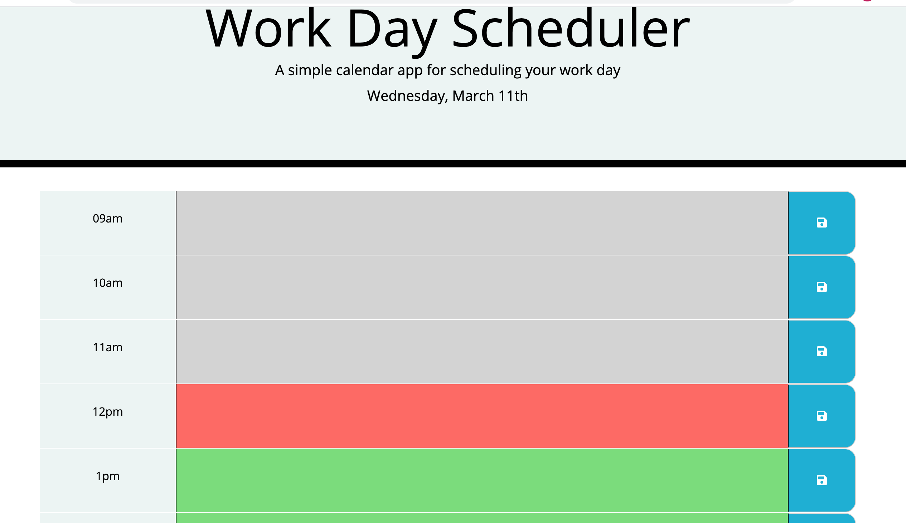
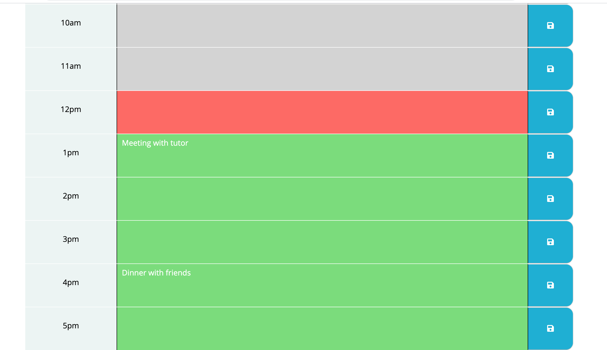

# Day-planner
<h2>URL: <a href="https://bikramshankhar.github.io/Day-planner/">Click me</a></h2>

This is a simple day planner application that allows the user to save events for each hour of the day. This app will run in the browser and feature dynamically updated HTML and CSS powered by jQuery. The app display standard business hours (9am to 5pm)

